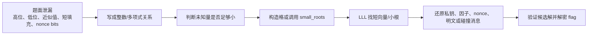

# 格密码 CTF 入门与 HTB 题型总结

CTF 里的“格密码”通常有两种含义：

1. 题目本身使用 LWE、NTRU、背包密码、HNP 等格相关构造。
2. 题目不是现代格密码，但可以用 LLL、Coppersmith、小根算法、格基规约去攻击弱参数。

第二种在 CTF 中更常见。你会经常看到 RSA、DSA/ECDSA、伪随机数、背包、椭圆曲线题，最后都被转化成一句话：

> 已知一个整数关系的大部分，只剩一个很小的未知量。把这个关系嵌入格里，用 LLL 找出短向量或小根。

本页基于 HTB crypto 题目的常见格攻击思路整理。覆盖关键词包括 `lattice`、`LLL`、`small_roots`、`Coppersmith`、`knapsack`、`fpylll`、`格基`、`格密码` 等；其中 `crypto_cryptoconundrum` 这类非格题因为连续字母误触发 `LLL`，不纳入本页。

HTB 原题可以在 Hack The Box 网站自行搜索。部分题目可能属于 retired challenges、活动题或付费内容，是否可见取决于 HTB 平台当前状态和账号权限。本页不会发布 flag、长常数或完整解题脚本；每个案例都改写成公开可读的“题面抽象 + 建模 + 解法步骤 + 验证点”，读者只看本页和本仓库示例也能学到方法。

## 关于 HTB

[Hack The Box](https://www.hackthebox.com/)（HTB）是一个面向网络安全学习、攻防训练和 CTF 挑战的平台，提供靶机、挑战题、学院课程、比赛和企业训练内容。Crypto 题一般可以从 [HTB Challenges](https://app.hackthebox.com/challenges) 入口查找，搜索题名即可找到可用题目。

## 一张图看 CTF 中的 LLL



关键直觉：

- LLL 不会神奇地“破解所有密码”。它只能帮你在一个设计好的整数格里找相对短的向量。
- CTF 的工作量通常在“建模”：把题面泄漏变成短向量、小根、近似公倍数、低密度背包或 Hidden Number Problem。
- 如果未知量不够小、维度太高、缩放不合理，LLL 会给你一个看起来很短但没有意义的向量。

## 环境建议

很多 CTF 格题需要 SageMath，因为 Sage 内置：

- `Matrix(ZZ, ...).LLL()`
- `PolynomialRing(Zmod(n))`
- `small_roots()`
- 有限域、椭圆曲线、理想、resultant 等代数工具

常用 Python 包：

- `pycryptodome`：RSA/AES/字节整数转换。
- `pwntools`：远程交互。
- `gmpy2`：大整数辅助。
- `fpylll`：更专业的格基规约库，适合高维或真实攻击实验。

本仓库的纯 Python LLL 示例适合理解原理，不适合替代 Sage/fpylll 去打大型题。

## 常见题型速查

| 题型 | 典型信号 | 格模型 | 常见工具 |
| --- | --- | --- | --- |
| 低密度背包 | `sum(a_i * bit_i) = c`，bit 是 0/1 | 子集和嵌入格，短向量第一段是 bit | `Matrix(ZZ).LLL()` |
| HNP / nonce 泄漏 | DSA/ECDSA nonce 泄露若干 bit | 把 nonce 误差作为小未知量 | LLL、Babai、HNP lattice |
| RSA 高位/低位泄漏 | 已知 `p` 高位或 `dp` 高位 | `p = p_high * 2^k + x`，找小 `x` | Coppersmith `small_roots` |
| RSA 小指数已知前缀 | `e=3`，明文有固定 prefix | `(prefix * 2^r + x)^e - c = 0 mod n` | univariate small roots |
| RSA short pad | 同一消息加两个短随机 pad | resultant 消去消息，先找 pad 差 | Coppersmith + Franklin-Reiter |
| 多变量小根 | 多个参数只泄漏高位 | 多变量 Coppersmith 格 | 自写 small roots / Sage |
| 有理数/模分式恢复 | `r = A / B mod n`，`A,B` 较小 | 二维格找小分子分母 | 2D LLL |
| 整数编码碰撞 | 签名只看 `bytes_to_long(msg) mod q` | 构造可打印字节向量满足同余 | LLL 同余碰撞 |

## 如何阅读这些案例

下面的题名来自 HTB crypto 题目。读者不需要知道原始端口、原始 flag 或完整常数，只需要关注四件事：

1. 题面泄漏了什么。
2. 未知量为什么“小”。
3. 这个“小未知量”如何变成格里的短向量或多项式小根。
4. LLL 输出后如何验证它是真解。

如果你刚开始学，建议先读 `AbraCryptabra`、`crypto_infinite_knapsack`、`WaitingList`、`YALM` 四个案例。它们分别代表背包、PRNG 状态、签名 nonce 泄漏、RSA 小根，是 CTF 中最常见的四个入口。

## HTB 题型案例：公开化抽象版

### 1. `AbraCryptabra`

题型：

- 截断 LCG 输出恢复。
- Merkle-Hellman 背包解密。
- 两段都可以用 LLL：第一段是 Hidden Number Problem，第二段是 0/1 子集和。

公开题面抽象：

- 服务端有一个 LCG：`s_{i+1} = a*s_i + c mod m`。
- 每次攻击者猜下一轮输出。如果猜错，服务端会泄漏真实输出的高 32 bit。
- 收集若干个高位输出后，要恢复 `c` 和初始状态，从而预测后续输出。
- 最后一阶段给出 Merkle-Hellman 风格公钥列表和一个密文和，要求恢复 flag bit。

建模：

- 服务端每轮泄露 LCG 高位输出：`state = a * state + c mod m`，输出 `state >> shift`。
- 未知低位是小误差。把多个输出写成线性关系，用 HNP 格恢复 `c` 和初始状态。
- 打赢交互后得到背包公钥 `a_i` 和密文和 `b`，构造矩阵：

```text
[1 0 ... 0 a_0]
[0 1 ... 0 a_1]
[. .     .  . ]
[0 0 ... 1 a_n]
[0 0 ... 0 -b ]
```

LLL 后寻找形如 `(bit_0, bit_1, ..., bit_n, 0)` 的短向量。

解法步骤：

1. 收集若干轮截断输出。
2. 用 HNP lattice 恢复 LCG 参数。
3. 预测后续输出通过游戏。
4. 解 AES 得到背包密文。
5. 用背包格恢复 bit 串，再转回 flag 文本。

验证点：

- 恢复出的 LCG 参数必须能重新生成已泄漏的所有高位输出。
- 背包恢复出的向量每一位必须是 `0/1`。
- `sum(a_i * bit_i)` 必须严格等于密文和。

### 2. `crypto_infinite_knapsack`

题型：

- Merkle-Hellman 背包加密 Python PRNG 状态。
- LLL 解多次 32 bit 子集和。

公开题面抽象：

- 程序先固定随机种子，然后保存 Python `random.getstate()`。
- 它用 32 维 Merkle-Hellman 背包加密 PRNG 状态数组中的每个整数。
- flag 被随机打乱并用一个依赖 PRNG 的小整数编码。
- 因此真正目标不是直接解 flag，而是先恢复 PRNG 状态。

建模：

- `source.py` 用 32 个公钥元素加密 Python `random.getstate()` 中的大量状态整数。
- 每个状态整数对应 32 个 bit，因此每个密文都是一次 32 维子集和。
- 解出 MT19937 状态后，可以复现 shuffle 和随机数，再还原 flag。

解法步骤：

1. 对 `encrypted_state[1]` 中每个整数单独跑子集和 LLL。
2. 得到 Python PRNG 状态数组。
3. `random.setstate(...)` 恢复随机状态。
4. 还原打乱顺序和自定义编码。

为什么这个题很适合练习：

- 每个状态整数都是独立的 32 bit 子集和，失败时可以逐个调试。
- 你能清楚看到“解密一个密码系统”有时只是第一层，真正的 flag 还藏在后续状态机里。

### 3. `WaitingList`

题型：

- DSA/ECDSA 风格签名 nonce 泄漏低 7 bit。
- Hidden Number Problem。

公开题面抽象：

- 服务端用 DSA/ECDSA 风格公式签名预约信息。
- 每条签名额外泄漏 nonce `k` 的低 7 bit。
- 题目给出大量历史签名，目标是恢复签名私钥，再伪造目标预约消息。

建模：

- 签名满足 `s_i * k_i = h_i + x * r_i mod n`。
- 每个 `k_i` 的低 7 bit 已知：`k_i = 2^7 * t_i + a_i`。
- 消去私钥 `x` 后，得到多组 `t_i` 的有界线性关系。
- 构造以 `n` 为对角线、末两行放 `A_i/B_i` 和缩放项的格，LLL 的短向量中包含私钥候选。

解法步骤：

1. 读取 `appointments.txt` 和 `signatures.txt`。
2. 根据第一条签名和其余签名构造 HNP 系数。
3. LLL 找短向量并恢复私钥。
4. 本地验证签名。
5. 对目标预约信息伪造签名。

验证点：

- 候选私钥必须能验证至少一条历史签名。
- 伪造签名应该先在本地验签，再提交给远程服务。
- 如果 LLL 找不到，优先检查签名数量、已知 bit 方向、缩放因子 `2^known_bits`。

### 4. `YALM`

题型：

- RSA `e = 3`。
- 明文前缀已知，未知 suffix 较短。
- Coppersmith univariate small roots。

公开题面抽象：

- 服务端返回一个 RSA 密文。
- 明文是一段固定英文模板加上 flag。
- 公钥指数很小：`e = 3`。
- 明文前缀已知，只有末尾 flag 后缀未知，而且长度有限。

建模：

```text
m = known_prefix * 2^(8r) + x
f(x) = m^3 - c = 0 mod n
```

只要 `x` 足够小，就可以用 `small_roots()` 找回 suffix。

解法步骤：

1. 枚举未知后缀长度 `r`。
2. 在 `Zmod(n)` 上构造 `f(x)`。
3. 调 `small_roots()` 得到未知后缀。
4. 拼回完整明文。

成功条件：

- `x` 的上界必须足够小。未知 suffix 太长时，`small_roots()` 不再稳定。
- 多数 CTF 中会枚举 suffix 字节数 `r`，因为 flag 长度可能未知。

### 5. `Bank-er-smith`

题型：

- RSA 素因子高位泄漏。
- Coppersmith partial key exposure。

公开题面抽象：

- 题面给出 RSA 模数 `n` 和一个“看起来像 p 的 fake prime”。
- fake prime 的高位与真实 `p` 相同，低位被污染或隐藏。
- 目标是恢复真实 `p` 的低位。

建模：

```text
p = p_high + x
f(x) = p_high + x = 0 mod p
```

虽然 `p` 未知，但 `p | n`，Sage 的 `small_roots(X=2^k, beta=...)` 可以在 `mod n` 中找出低位 `x`。

解法步骤：

1. 从 fake prime 中截取可信高位 `p_high`。
2. 设低 256 bit 为 `x`。
3. 调 Coppersmith 小根恢复 `x`。
4. 得到 `p` 后分解 `n`，再解 RSA。

验证点：

- `p` 必须整除 `n`。
- `p` 的 bit length 应该与预期素因子长度一致。
- 分解后再检查 `p*q == n`，不要只相信小根输出。

### 6. `LostModulusAgain`

题型：

- RSA `e = 3`。
- 两次加短随机 pad。
- Coppersmith short-pad attack + Franklin-Reiter related-message attack。

公开题面抽象：

- 同一个 flag 被加上两段短随机 padding 后分别加密。
- 加密指数是 `e = 3`。
- padding 不长，所以两个明文之间的差 `diff` 是小未知量。
- 一旦 `diff` 被恢复，两条消息就是 related messages。

建模：

```text
c1 = m^e mod n
c2 = (m + diff)^e mod n
```

先用 resultant 消去 `m`，得到关于短差值 `diff` 的单变量多项式，再用 `small_roots()` 求 `diff`。随后用 Franklin-Reiter 的多项式 gcd 直接恢复 `m`。

解法步骤：

1. 从已知明文/密文对恢复或确认 `n`。
2. 对两段 flag ciphertext 构造 `g1, g2`。
3. resultant 得到 `diff` 的小根方程。
4. 用 related-message gcd 恢复原消息。

容易踩坑：

- short-pad attack 的第一步找的是 `diff`，不是直接找明文。
- resultant 消元后要把多项式转成单变量并设为 monic。
- 找到 `diff` 后，Franklin-Reiter 是多项式 gcd，不是普通整数 gcd。

### 7. `crypto_interception`

题型：

- 先用已知明文 RSA 恢复模数。
- 服务端 token 泄漏 `q` 的高位。
- Coppersmith 恢复低位因子。

公开题面抽象：

- 服务端没有直接告诉你 RSA 模数 `N`。
- 但它会对候选问候语加密，候选明文来自一个小列表。
- 对任意正确明文密文对，都有 `m^e - c` 是 `N` 的倍数。
- 拿到 `N` 后，服务端又给出一个 token，其中包含 `q` 的高位。

建模：

已知若干候选明文 `m` 和密文 `c`，利用：

```text
n | (m^e - c)
```

对多组取 gcd 可以找出 `n`。随后 token 给出 `q_high`，设：

```text
q = q_high + x
```

用 `small_roots(X=2^unknown_bits)` 恢复 `x`。

解法步骤：

1. 从问答列表中枚举候选明文，gcd 找 `N`。
2. 通过 hash 验证后拿到含 `q` 高位的 token。
3. Coppersmith 求 `q` 低位。
4. 分解 `N` 后生成服务端对称密钥。

这个案例的重点：

- LLL/Coppersmith 不是第一步。第一步是从协议行为里恢复缺失的公钥参数。
- CTF 中经常先用 gcd、枚举、oracle 交互把数学对象补齐，再进入格攻击。

### 8. `crypto_mayday_mayday`

题型：

- RSA CRT 私钥指数 `dp, dq` 高位泄漏。
- Coppersmith 恢复 `dp` 低位。

公开题面抽象：

- 题面给出 RSA `N,e,c`。
- 还给出 CRT 私钥指数 `dp = d mod (p-1)` 和 `dq = d mod (q-1)` 的高位。
- 低位未知，但长度固定。
- 目标是通过 `dp,dq` 的结构恢复 `p,q`。

建模：

RSA CRT 有：

```text
e * dp = 1 + k * (p - 1)
e * dq = 1 + l * (q - 1)
```

题目给出 `dp, dq` 的高 512 bit。先估计 `k*l`，再解出 `k,l`。随后构造关于 `dp_low` 的小根方程，恢复完整 `dp`，进一步得到 `p`。

解法步骤：

1. 由 `dp_msb, dq_msb, N, e` 估算 `A = k*l`。
2. 根据 `k+l` 和 `k*l` 求 `k,l`。
3. 对 `dp_low` 调 `small_roots()`。
4. 用 `p = (e*dp + k - 1) / k` 分解 RSA。

为什么 `k,l` 重要：

- 由 `e*dp = 1 + k*(p-1)` 可知，只要有完整 `dp` 和 `k`，就能直接得到 `p`。
- 高位泄漏让我们能估算 `k*l`，这一步把问题从“两个大素因子”变成“小根恢复低位”。

### 9. `crypto_elliptic_labyrinth`

题型：

- 椭圆曲线参数 `a,b` 高位泄漏。
- 多变量 Coppersmith small roots。

公开题面抽象：

- 服务端生成一条曲线 `y^2 = x^3 + a*x + b mod p`。
- 给出一个曲线点 `(x,y)`。
- 只泄漏 `a,b` 的高位，即 `a >> r`、`b >> r`。
- 因为点必须满足曲线方程，低位 `c,d` 受到一个二元多项式约束。

建模：

服务端给一个曲线点 `(x,y)` 和：

```text
p, a_high = a >> r, b_high = b >> r
```

曲线方程：

```text
y^2 = x^3 + a*x + b mod p
```

设 `a = a_high * 2^r + c`，`b = b_high * 2^r + d`。未知 `c,d` 都小于 `2^r`，于是得到二元小根问题。

解法步骤：

1. 枚举可能的 `r`。
2. 构造二元多项式 `f(c,d)`。
3. 用自写 small-roots lattice 规约恢复 `c,d`。
4. 得到完整 `a,b` 后计算 AES key 解密。

这个案例的重点：

- 多变量小根比单变量更脆弱，参数 `m,d,bounds` 很影响成功率。
- CTF 中常见做法是枚举 `r`，因为泄漏位数可能在一个范围内随机选择。

### 10. `crypto_vitrium_stash`

题型：

- DSA 风格签名把 message 当作整数并在 `mod q` 下验证。
- 构造两个 JSON 字符串，使 `bytes_to_long(message_1) == bytes_to_long(message_2) mod q`。
- LLL 生成可打印 username 碰撞。

公开题面抽象：

- 注册普通用户时，服务端会签名一个 JSON，例如 `{"username": "...", "admin": false}`。
- 验签时，服务端把整个 message 解释成大整数，再在 `mod q` 下参与 DSA 验证。
- 如果能构造另一个 `admin: true` JSON，使它与普通用户 JSON 在 `mod q` 下相同，就能复用签名。

建模：

签名验证只依赖 `m mod q`。如果拿到普通用户消息的签名，但能构造另一个 admin JSON 与其整数编码同余，就可以复用签名。

LLL 矩阵把每个可控字符看作有界变量，最后一列编码 `256^i` 权重和 `q` 的倍数，目标是找到：

```text
controlled_message - target_message = 0 mod q
```

解法步骤：

1. 用 LLL 找一段可打印 username，使普通用户 JSON 与 admin JSON 同余。
2. 向服务端注册该 username，获得普通消息签名。
3. 提交 admin JSON 和原签名。
4. 验证通过后读取 stash。

为什么这是格题：

- 可控 username 的每个字符都是一个小整数变量。
- `bytes_to_long()` 本质是按 `256^i` 加权求和。
- 要求两个消息同余，就是一个带有字符范围约束的线性同余问题。

### 11. `crypto_quadratic_points`

题型：

- 第一关是浮点数/近似关系的短整数关系。
- LLL 用作 integer relation / Diophantine approximation。
- 第二关转入椭圆曲线离散对数。

公开题面抽象：

- 服务端给出一个浮点数 `x`。
- 要求快速提交较小整数 `a,b,c`，满足 `a*x^2 + b*x + c` 足够接近 0。
- 这不是现代格密码，但 LLL 是寻找短整数关系的经典工具。

建模：

服务端给 `x`，要求短系数 `a,b,c` 满足：

```text
a*x^2 + b*x + c == 0
```

`lll.sage` 构造近似关系矩阵：

```text
[1 0 0 scale*x^2]
[0 1 0 scale*x  ]
[0 0 1 scale    ]
```

LLL 找到短的 `(a,b,c)`。

解法步骤：

1. 对给出的浮点 `x` 用 LLL 找小整数关系。
2. 通过第一阶段。
3. 读取椭圆曲线点 `G, nG, p`。
4. 对小参数曲线做离散对数恢复 flag。

学习价值：

- 这是“格不只用于密码”的好例子。
- 只要你看到“浮点近似 + 小整数系数 + 线性组合接近 0”，就应该想到 integer relation。

### 12. `crypto_zombie_rolled`

题型：

- 自定义 RSA-like / fraction-based 签名。
- 从 `r = A * B^{-1} mod n` 恢复较小的 `A,B`。
- 2 维 LLL 恢复模分式的有理表示。

公开题面抽象：

- 自定义签名中出现了分式表达式。
- 服务端只公开分式在 `mod n` 下的值 `r`。
- 如果真实分子 `A` 和分母 `B` 比 `n` 小很多，就可以用二维格恢复这个有理表示。

建模：

脚本中使用：

```text
Matrix(ZZ, [[r, n], [1, 0]]).transpose().LLL()[0]
```

直觉是：如果存在相对较小的 `A,B` 使 `r = A / B mod n`，那么二维格里有一个短向量对应 `(A,B)`。

恢复 `A,B` 后，把签名公式改写成多项式方程，再用 Sage 求解，最终恢复消息或私钥相关值。

解法步骤：

1. 从输出中获得 `r,c,n` 等值。
2. 2D LLL 得到小的分子/分母。
3. 建立 `m,h` 多项式系统。
4. 求解并转回字节。

配套示例：

```bash
python3 examples/06_ctf_rational_reconstruction_lll.py
```

它演示如何从公开的 `r = A * B^(-1) mod n` 中恢复小的 `A/B`。

## 完整推导 1：子集和背包如何进格

公开化 toy 题面：

```text
给定 weights = [a_0, a_1, ..., a_15]
给定 target = sum(a_i * bit_i)
已知每个 bit_i 都是 0 或 1
恢复 16 个 bit，并按 ASCII 解码
```

直接暴力需要枚举 `2^16` 个 bit。真实 CTF 中可能是 `2^256` 或更大，暴力就不可行。低密度背包的核心是：正确 bit 向量很短，因为它只由 `0/1` 组成。

构造矩阵：

```text
M =
[1 0 0 ... 0 a_0]
[0 1 0 ... 0 a_1]
[0 0 1 ... 0 a_2]
[. . .     . .  ]
[0 0 0 ... 1 a_n]
[0 0 0 ... 0 -target]
```

如果向量 `x = (bit_0, ..., bit_n, 1)` 乘上这个基，就会得到：

```text
(bit_0, ..., bit_n, sum(a_i * bit_i) - target)
```

当 bit 正确时，最后一维是 0，整个向量只剩很多 `0/1`，特别短。LLL 的任务就是把这个异常短的向量找出来。

运行本仓库示例：

```bash
python3 examples/05_ctf_knapsack_lll.py
```

你会看到输出恢复了二进制：

```text
0100111101001011
```

按 ASCII 解码就是 `OK`。

调试经验：

- 如果 LLL 输出不是 0/1，先检查矩阵最后一行是否是 `-target`。
- 如果输出向量最后一维不是 0，说明没有找到准确子集。
- 如果权重之间自己有很多短关系，LLL 可能先找到那些无关关系，需要换嵌入方式或加强缩放。

## 完整推导 2：nonce 泄漏为什么会暴露签名私钥

DSA/ECDSA 风格签名有一个危险点：每次签名都要用一次性随机数 `k`。简化公式如下：

```text
s_i = k_i^{-1} * (h_i + x*r_i) mod n
```

其中：

- `x` 是长期私钥。
- `h_i` 是消息哈希。
- `r_i, s_i` 是公开签名。
- `k_i` 是必须保密的一次性 nonce。

移项：

```text
s_i * k_i = h_i + x*r_i mod n
```

如果每个 `k_i` 泄漏低 `b` bit，则：

```text
k_i = known_i + 2^b * t_i
```

未知的是 `t_i`。它仍然很大，但因为我们有很多签名，可以消去私钥 `x`。对第 `i` 条和第 `0` 条签名分别写：

```text
x = r_i^{-1} * (s_i*k_i - h_i) mod n
x = r_0^{-1} * (s_0*k_0 - h_0) mod n
```

两式相等：

```text
r_i^{-1} * s_i * k_i - r_0^{-1} * s_0 * k_0
= r_i^{-1} * h_i - r_0^{-1} * h_0 mod n
```

把 `k_i = known_i + 2^b*t_i` 代入后，得到很多关于 `t_i` 的线性同余。HNP 格的作用是找到一组小误差 `t_i`，让这些同余同时成立。

真正做题时的流程：

1. 读入多条 `(h_i, r_i, s_i, leaked_bits_i)`。
2. 选第一条作为参考签名。
3. 构造 HNP 系数 `A_i, B_i`。
4. 用 `n` 做对角线、把 `A_i/B_i` 和缩放项放到末行。
5. LLL 后从短向量恢复 `k_0` 或直接恢复 `x`。
6. 用恢复的 `x` 验证历史签名。

这个验证步骤非常关键，因为 HNP 的矩阵很容易因为符号、逆元或 bit 方向写错而产生“看起来合理”的假结果。

## 完整推导 3：Coppersmith 小根题的统一模板

CTF 中大量 RSA 格题都可以归纳为：

```text
f(x) = 0 mod n
并且 |x| < X
```

只要 `x` 足够小，Coppersmith 方法就可能恢复它。Sage 的 `small_roots()` 把底层格构造封装好了，所以解题脚本往往很短，但你仍然要知道自己在找什么。

### 已知 p 高位

题面给：

```text
n = p*q
p = p_high * 2^k + x
0 <= x < 2^k
```

建模：

```python
PR.<x> = PolynomialRing(Zmod(n))
f = p_high * 2^k + x
root = f.small_roots(X=2^k, beta=0.4)[0]
p = p_high * 2^k + root
assert n % p == 0
```

### 已知明文前缀

题面给：

```text
c = m^e mod n
m = prefix * 2^k + x
```

建模：

```python
PR.<x> = PolynomialRing(Zmod(n))
f = (prefix * 2^k + x)^e - c
root = f.small_roots(X=2^k)[0]
m = prefix * 2^k + root
assert pow(m, e, n) == c
```

### 已知 dp 高位

题面给：

```text
e*dp = 1 + k*(p-1)
dp = dp_high * 2^t + x
```

做法比前两类多一步：先通过高位估计 `k` 或 `k*l`，再对 `x = dp_low` 做小根。恢复完整 `dp` 后：

```text
p = (e*dp + k - 1) / k
```

经验判断：

- `small_roots()` 成功的前提是未知量上界真的小。
- 如果不知道长度，就枚举 `k` 或未知字节数。
- 每个候选根都要代回验证，例如 `n % p == 0` 或 `pow(m,e,n) == c`。

## 完整推导 4：JSON 同余碰撞为什么能伪造签名

考虑一个错误实现：

```text
sign(message):
    m = bytes_to_long(message)
    return DSA_sign(m)

verify(message, sig):
    m = bytes_to_long(message)
    return DSA_verify(m mod q, sig)
```

如果 DSA 只在 `mod q` 下使用 `m`，那攻击目标就是：

```text
bytes_to_long(normal_json) == bytes_to_long(admin_json) mod q
```

`bytes_to_long()` 本质上是：

```text
m = c_0 * 256^(L-1) + c_1 * 256^(L-2) + ... + c_{L-1}
```

如果 username 可控，那么每个字符 `c_i` 都是一个小变量。为了让它可打印，可以写成：

```text
c_i = base + delta_i
```

例如 `base = 80`，让 `delta_i` 落在一个较小范围。于是同余变成：

```text
sum(delta_i * 256^i) + constant = multiple * q
```

这就是整数线性同余。LLL 矩阵的目标是找小的 `delta_i`，同时让最后的同余误差为 0。

解题时通常分两步：

1. 离线用 LLL 生成一个普通用户 JSON，使它和目标 admin JSON 同余。
2. 在线注册普通用户拿签名，再把签名附到 admin JSON 上提交。

安全教训：

- 签名必须绑定明确的字节串和语义，不要只签 `mod q` 后的数。
- JSON 序列化也要规范化，否则空格、字段顺序、大小写都可能成为攻击面。

## 完整推导 5：二维 LLL 恢复小分式

有些自定义密码会公开：

```text
r = A * B^{-1} mod n
```

如果 `A` 和 `B` 都远小于 `n`，可以把它看成：

```text
B*r = A mod n
B*r - k*n = A
```

这说明存在整数 `B,k`，让：

```text
B*(r, 1) - k*(n, 0) = (A, B)
```

所以在二维格：

```text
basis = [(r, 1), (n, 0)]
```

里，`(A,B)` 是一个很短的向量。LLL 对二维格非常有效，通常会直接把它放到规约后基的第一行。

运行本仓库示例：

```bash
python3 examples/06_ctf_rational_reconstruction_lll.py
```

你会看到 LLL 直接恢复隐藏的 `A/B`。真实题中恢复出 `A,B` 后，常见下一步是把签名或加密公式从模分式还原为普通多项式，再用代数方程求消息。

## 解题 checklist

拿到一道疑似格题，可以按这个顺序检查：

1. 是否有 `LLL`、`small_roots`、`lattice`、`knapsack`、`Coppersmith`、`partial`、`known bits`、`nonce leak` 等信号。
2. 未知量到底是什么：bit 串、nonce 误差、素因子低位、明文 suffix、padding 差值，还是可控消息字符。
3. 未知量上界是多少：`2^k`、可打印 ASCII 范围、0/1、短随机数。
4. 方程在哪个环里成立：整数、`mod n`、`mod q`、多项式环、椭圆曲线方程。
5. 维度是否合理：背包维度通常是 bit 数加一；HNP 维度通常是签名数量加两；Coppersmith 依赖小根界。
6. 缩放是否合理：不同坐标的量级需要接近，否则 LLL 会被大列支配。
7. LLL 输出怎么验证：重新代回方程、检查 bit 是否 0/1、检查因子是否整除 `n`、检查签名是否通过。

## 常用建模模板

### 子集和 / 背包

目标：

```text
sum(a_i * x_i) = b, x_i in {0,1}
```

矩阵：

```text
for i:
    M[i, i] = 1
    M[i, -1] = a_i
M[-1, -1] = -b
```

找短向量 `(x_0, ..., x_n, 0)`。

### RSA 已知高位因子

目标：

```text
p = p_high * 2^k + x
p | n
```

Sage 骨架：

```python
PR.<x> = PolynomialRing(Zmod(n))
f = p_high * 2^k + x
root = f.small_roots(X=2^k, beta=0.4)[0]
p = p_high * 2^k + root
```

### RSA 小指数已知前缀

目标：

```text
m = prefix * 2^k + x
c = m^e mod n
```

Sage 骨架：

```python
PR.<x> = PolynomialRing(Zmod(n))
f = (prefix * 2^k + x)^e - c
root = f.small_roots(X=2^k)[0]
```

### HNP / nonce bits

签名关系：

```text
s_i * k_i = h_i + x * r_i mod n
k_i = known_i + scale * t_i
```

核心是消去私钥 `x`，得到若干 `t_i` 的小误差线性关系，再用对角线上放 `n`、末行放系数和缩放的格求短向量。

## 本仓库示例

运行一个纯 Python 的背包 LLL CTF demo：

```bash
python3 examples/05_ctf_knapsack_lll.py
```

这个例子复现了 `AbraCryptabra` 和 `crypto_infinite_knapsack` 中最常见的子集和嵌入方法。真实 HTB 题需要 SageMath、pwntools 和更强的 LLL 实现，但矩阵形状和验证逻辑是一致的。

## 练习题

1. 为什么低密度背包能用 LLL，而随机高密度背包通常不容易？
2. 在 RSA 已知高位因子题中，为什么未知低位必须“小”？
3. `small_roots()` 返回候选根后，为什么一定要代回原方程验证？
4. ECDSA nonce 只泄漏 1 bit 时，是否一定能用 LLL 成功？还需要什么条件？
5. 为什么 `bytes_to_long(message) mod q` 这种签名实现容易被消息碰撞利用？

简要答案：

1. 低密度意味着正确 bit 向量对应的格向量异常短，LLL 更容易把它放到前面。
2. Coppersmith 的理论保证依赖小根界；未知部分过大时，小根不再是算法能稳定找到的范围。
3. LLL 和小根算法可能产生伪候选；代回验证是最便宜也最可靠的过滤器。
4. 不一定。需要足够多的签名、正确的方程、合理的缩放，以及泄漏 bit 数和维度之间的平衡。
5. 因为签名没有绑定完整字节串语义，只绑定了模 `q` 的整数值；不同 JSON 可以映射到同一个模值。
