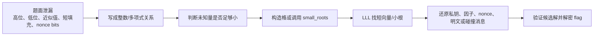

# 格密码 CTF 入门与 HTB 题型总结

CTF 里的“格密码”通常有两种含义：

1. 题目本身使用 LWE、NTRU、背包密码、HNP 等格相关构造。
2. 题目不是现代格密码，但可以用 LLL、Coppersmith、小根算法、格基规约去攻击弱参数。

第二种在 CTF 中更常见。你会经常看到 RSA、DSA/ECDSA、伪随机数、背包、椭圆曲线题，最后都被转化成一句话：

> 已知一个整数关系的大部分，只剩一个很小的未知量。把这个关系嵌入格里，用 LLL 找出短向量或小根。

本页基于 `ShundaZhang/htb` 仓库中 `ctf/crypto` 目录的本地稀疏扫描整理。扫描关键词包括 `lattice`、`LLL`、`small_roots`、`Coppersmith`、`knapsack`、`fpylll`、`格基`、`格密码` 等。中文关键词没有命中；`crypto_cryptoconundrum` 因连续字母误触发 `LLL`，已剔除。

为了避免把私有 HTB 仓库中的 flag、长常数和完整解题脚本原样发布到这个 public 教学仓库，本页只保留题目目录、相关文件、建模思路和解法骨架。

## 一张图看 CTF 中的 LLL



关键直觉：

- LLL 不会神奇地“破解所有密码”。它只能帮你在一个设计好的整数格里找相对短的向量。
- CTF 的工作量通常在“建模”：把题面泄漏变成短向量、小根、近似公倍数、低密度背包或 Hidden Number Problem。
- 如果未知量不够小、维度太高、缩放不合理，LLL 会给你一个看起来很短但没有意义的向量。

## 环境建议

很多 CTF 格题需要 SageMath，因为 Sage 内置：

- `Matrix(ZZ, ...).LLL()`
- `PolynomialRing(Zmod(n))`
- `small_roots()`
- 有限域、椭圆曲线、理想、resultant 等代数工具

常用 Python 包：

- `pycryptodome`：RSA/AES/字节整数转换。
- `pwntools`：远程交互。
- `gmpy2`：大整数辅助。
- `fpylll`：更专业的格基规约库，适合高维或真实攻击实验。

本仓库的纯 Python LLL 示例适合理解原理，不适合替代 Sage/fpylll 去打大型题。

## 常见题型速查

| 题型 | 典型信号 | 格模型 | 常见工具 |
| --- | --- | --- | --- |
| 低密度背包 | `sum(a_i * bit_i) = c`，bit 是 0/1 | 子集和嵌入格，短向量第一段是 bit | `Matrix(ZZ).LLL()` |
| HNP / nonce 泄漏 | DSA/ECDSA nonce 泄露若干 bit | 把 nonce 误差作为小未知量 | LLL、Babai、HNP lattice |
| RSA 高位/低位泄漏 | 已知 `p` 高位或 `dp` 高位 | `p = p_high * 2^k + x`，找小 `x` | Coppersmith `small_roots` |
| RSA 小指数已知前缀 | `e=3`，明文有固定 prefix | `(prefix * 2^r + x)^e - c = 0 mod n` | univariate small roots |
| RSA short pad | 同一消息加两个短随机 pad | resultant 消去消息，先找 pad 差 | Coppersmith + Franklin-Reiter |
| 多变量小根 | 多个参数只泄漏高位 | 多变量 Coppersmith 格 | 自写 small roots / Sage |
| 有理数/模分式恢复 | `r = A / B mod n`，`A,B` 较小 | 二维格找小分子分母 | 2D LLL |
| 整数编码碰撞 | 签名只看 `bytes_to_long(msg) mod q` | 构造可打印字节向量满足同余 | LLL 同余碰撞 |

## 从 HTB 仓库扫到的题目

### 1. `AbraCryptabra`

相关文件：

- `ctf/crypto/AbraCryptabra/server.py`
- `ctf/crypto/AbraCryptabra/dec.sage`

题型：

- 截断 LCG 输出恢复。
- Merkle-Hellman 背包解密。
- 两段都可以用 LLL：第一段是 Hidden Number Problem，第二段是 0/1 子集和。

建模：

- 服务端每轮泄露 LCG 高位输出：`state = a * state + c mod m`，输出 `state >> shift`。
- 未知低位是小误差。把多个输出写成线性关系，用 HNP 格恢复 `c` 和初始状态。
- 打赢交互后得到背包公钥 `a_i` 和密文和 `b`，构造矩阵：

```text
[1 0 ... 0 a_0]
[0 1 ... 0 a_1]
[. .     .  . ]
[0 0 ... 1 a_n]
[0 0 ... 0 -b ]
```

LLL 后寻找形如 `(bit_0, bit_1, ..., bit_n, 0)` 的短向量。

解法步骤：

1. 收集若干轮截断输出。
2. 用 HNP lattice 恢复 LCG 参数。
3. 预测后续输出通过游戏。
4. 解 AES 得到背包密文。
5. 用背包格恢复 bit 串，再转回 flag 文本。

### 2. `crypto_infinite_knapsack`

相关文件：

- `ctf/crypto/crypto_infinite_knapsack/source.py`
- `ctf/crypto/crypto_infinite_knapsack/dec.sage`
- `ctf/crypto/crypto_infinite_knapsack/out.txt`

题型：

- Merkle-Hellman 背包加密 Python PRNG 状态。
- LLL 解多次 32 bit 子集和。

建模：

- `source.py` 用 32 个公钥元素加密 Python `random.getstate()` 中的大量状态整数。
- 每个状态整数对应 32 个 bit，因此每个密文都是一次 32 维子集和。
- 解出 MT19937 状态后，可以复现 shuffle 和随机数，再还原 flag。

解法步骤：

1. 对 `encrypted_state[1]` 中每个整数单独跑子集和 LLL。
2. 得到 Python PRNG 状态数组。
3. `random.setstate(...)` 恢复随机状态。
4. 还原打乱顺序和自定义编码。

### 3. `WaitingList`

相关文件：

- `ctf/crypto/WaitingList/challenge.py`
- `ctf/crypto/WaitingList/dec.sage`
- `ctf/crypto/WaitingList/dec.py`
- `ctf/crypto/WaitingList/appointments.txt`
- `ctf/crypto/WaitingList/signatures.txt`

题型：

- DSA/ECDSA 风格签名 nonce 泄漏低 7 bit。
- Hidden Number Problem。

建模：

- 签名满足 `s_i * k_i = h_i + x * r_i mod n`。
- 每个 `k_i` 的低 7 bit 已知：`k_i = 2^7 * t_i + a_i`。
- 消去私钥 `x` 后，得到多组 `t_i` 的有界线性关系。
- 构造以 `n` 为对角线、末两行放 `A_i/B_i` 和缩放项的格，LLL 的短向量中包含私钥候选。

解法步骤：

1. 读取 `appointments.txt` 和 `signatures.txt`。
2. 根据第一条签名和其余签名构造 HNP 系数。
3. LLL 找短向量并恢复私钥。
4. 本地验证签名。
5. 对目标预约信息伪造签名。

### 4. `YALM`

相关文件：

- `ctf/crypto/YALM/server.py`
- `ctf/crypto/YALM/dec.sage`

题型：

- RSA `e = 3`。
- 明文前缀已知，未知 suffix 较短。
- Coppersmith univariate small roots。

建模：

```text
m = known_prefix * 2^(8r) + x
f(x) = m^3 - c = 0 mod n
```

只要 `x` 足够小，就可以用 `small_roots()` 找回 suffix。

解法步骤：

1. 枚举未知后缀长度 `r`。
2. 在 `Zmod(n)` 上构造 `f(x)`。
3. 调 `small_roots()` 得到未知后缀。
4. 拼回完整明文。

### 5. `Bank-er-smith`

相关文件：

- `ctf/crypto/Bank-er-smith/dec.sage`
- `ctf/crypto/Bank-er-smith/dec.py`

题型：

- RSA 素因子高位泄漏。
- Coppersmith partial key exposure。

建模：

```text
p = p_high + x
f(x) = p_high + x = 0 mod p
```

虽然 `p` 未知，但 `p | n`，Sage 的 `small_roots(X=2^k, beta=...)` 可以在 `mod n` 中找出低位 `x`。

解法步骤：

1. 从 fake prime 中截取可信高位 `p_high`。
2. 设低 256 bit 为 `x`。
3. 调 Coppersmith 小根恢复 `x`。
4. 得到 `p` 后分解 `n`，再解 RSA。

### 6. `LostModulusAgain`

相关文件：

- `ctf/crypto/LostModulusAgain/challenge.py`
- `ctf/crypto/LostModulusAgain/dec.sage`
- `ctf/crypto/LostModulusAgain/output.txt`

题型：

- RSA `e = 3`。
- 两次加短随机 pad。
- Coppersmith short-pad attack + Franklin-Reiter related-message attack。

建模：

```text
c1 = m^e mod n
c2 = (m + diff)^e mod n
```

先用 resultant 消去 `m`，得到关于短差值 `diff` 的单变量多项式，再用 `small_roots()` 求 `diff`。随后用 Franklin-Reiter 的多项式 gcd 直接恢复 `m`。

解法步骤：

1. 从已知明文/密文对恢复或确认 `n`。
2. 对两段 flag ciphertext 构造 `g1, g2`。
3. resultant 得到 `diff` 的小根方程。
4. 用 related-message gcd 恢复原消息。

### 7. `crypto_interception`

相关文件：

- `ctf/crypto/crypto_interception/server.py`
- `ctf/crypto/crypto_interception/dec.sage`
- `ctf/crypto/crypto_interception/pool.py`

题型：

- 先用已知明文 RSA 恢复模数。
- 服务端 token 泄漏 `q` 的高位。
- Coppersmith 恢复低位因子。

建模：

已知若干候选明文 `m` 和密文 `c`，利用：

```text
n | (m^e - c)
```

对多组取 gcd 可以找出 `n`。随后 token 给出 `q_high`，设：

```text
q = q_high + x
```

用 `small_roots(X=2^unknown_bits)` 恢复 `x`。

解法步骤：

1. 从问答列表中枚举候选明文，gcd 找 `N`。
2. 通过 hash 验证后拿到含 `q` 高位的 token。
3. Coppersmith 求 `q` 低位。
4. 分解 `N` 后生成服务端对称密钥。

### 8. `crypto_mayday_mayday`

相关文件：

- `ctf/crypto/crypto_mayday_mayday/source.py`
- `ctf/crypto/crypto_mayday_mayday/dec.sage`
- `ctf/crypto/crypto_mayday_mayday/dec2.sage`
- `ctf/crypto/crypto_mayday_mayday/output.txt`

题型：

- RSA CRT 私钥指数 `dp, dq` 高位泄漏。
- Coppersmith 恢复 `dp` 低位。

建模：

RSA CRT 有：

```text
e * dp = 1 + k * (p - 1)
e * dq = 1 + l * (q - 1)
```

题目给出 `dp, dq` 的高 512 bit。先估计 `k*l`，再解出 `k,l`。随后构造关于 `dp_low` 的小根方程，恢复完整 `dp`，进一步得到 `p`。

解法步骤：

1. 由 `dp_msb, dq_msb, N, e` 估算 `A = k*l`。
2. 根据 `k+l` 和 `k*l` 求 `k,l`。
3. 对 `dp_low` 调 `small_roots()`。
4. 用 `p = (e*dp + k - 1) / k` 分解 RSA。

### 9. `crypto_elliptic_labyrinth`

相关文件：

- `ctf/crypto/crypto_elliptic_labyrinth/server.py`
- `ctf/crypto/crypto_elliptic_labyrinth/dec.sage`

题型：

- 椭圆曲线参数 `a,b` 高位泄漏。
- 多变量 Coppersmith small roots。

建模：

服务端给一个曲线点 `(x,y)` 和：

```text
p, a_high = a >> r, b_high = b >> r
```

曲线方程：

```text
y^2 = x^3 + a*x + b mod p
```

设 `a = a_high * 2^r + c`，`b = b_high * 2^r + d`。未知 `c,d` 都小于 `2^r`，于是得到二元小根问题。

解法步骤：

1. 枚举可能的 `r`。
2. 构造二元多项式 `f(c,d)`。
3. 用自写 small-roots lattice 规约恢复 `c,d`。
4. 得到完整 `a,b` 后计算 AES key 解密。

### 10. `crypto_vitrium_stash`

相关文件：

- `ctf/crypto/crypto_vitrium_stash/server.py`
- `ctf/crypto/crypto_vitrium_stash/dec.sage`
- `ctf/crypto/crypto_vitrium_stash/dec2.sage`

题型：

- DSA 风格签名把 message 当作整数并在 `mod q` 下验证。
- 构造两个 JSON 字符串，使 `bytes_to_long(message_1) == bytes_to_long(message_2) mod q`。
- LLL 生成可打印 username 碰撞。

建模：

签名验证只依赖 `m mod q`。如果拿到普通用户消息的签名，但能构造另一个 admin JSON 与其整数编码同余，就可以复用签名。

LLL 矩阵把每个可控字符看作有界变量，最后一列编码 `256^i` 权重和 `q` 的倍数，目标是找到：

```text
controlled_message - target_message = 0 mod q
```

解法步骤：

1. 用 LLL 找一段可打印 username，使普通用户 JSON 与 admin JSON 同余。
2. 向服务端注册该 username，获得普通消息签名。
3. 提交 admin JSON 和原签名。
4. 验证通过后读取 stash。

### 11. `crypto_quadratic_points`

相关文件：

- `ctf/crypto/crypto_quadratic_points/server.py`
- `ctf/crypto/crypto_quadratic_points/lll.sage`
- `ctf/crypto/crypto_quadratic_points/dec.py`
- `ctf/crypto/crypto_quadratic_points/dec.sage`

题型：

- 第一关是浮点数/近似关系的短整数关系。
- LLL 用作 integer relation / Diophantine approximation。
- 第二关转入椭圆曲线离散对数。

建模：

服务端给 `x`，要求短系数 `a,b,c` 满足：

```text
a*x^2 + b*x + c == 0
```

`lll.sage` 构造近似关系矩阵：

```text
[1 0 0 scale*x^2]
[0 1 0 scale*x  ]
[0 0 1 scale    ]
```

LLL 找到短的 `(a,b,c)`。

解法步骤：

1. 对给出的浮点 `x` 用 LLL 找小整数关系。
2. 通过第一阶段。
3. 读取椭圆曲线点 `G, nG, p`。
4. 对小参数曲线做离散对数恢复 flag。

### 12. `crypto_zombie_rolled`

相关文件：

- `ctf/crypto/crypto_zombie_rolled/source.py`
- `ctf/crypto/crypto_zombie_rolled/lll.sage`
- `ctf/crypto/crypto_zombie_rolled/dec.sage`
- `ctf/crypto/crypto_zombie_rolled/output.txt`

题型：

- 自定义 RSA-like / fraction-based 签名。
- 从 `r = A * B^{-1} mod n` 恢复较小的 `A,B`。
- 2 维 LLL 恢复模分式的有理表示。

建模：

脚本中使用：

```text
Matrix(ZZ, [[r, n], [1, 0]]).transpose().LLL()[0]
```

直觉是：如果存在相对较小的 `A,B` 使 `r = A / B mod n`，那么二维格里有一个短向量对应 `(A,B)`。

恢复 `A,B` 后，把签名公式改写成多项式方程，再用 Sage 求解，最终恢复消息或私钥相关值。

解法步骤：

1. 从输出中获得 `r,c,n` 等值。
2. 2D LLL 得到小的分子/分母。
3. 建立 `m,h` 多项式系统。
4. 求解并转回字节。

## 解题 checklist

拿到一道疑似格题，可以按这个顺序检查：

1. 是否有 `LLL`、`small_roots`、`lattice`、`knapsack`、`Coppersmith`、`partial`、`known bits`、`nonce leak` 等信号。
2. 未知量到底是什么：bit 串、nonce 误差、素因子低位、明文 suffix、padding 差值，还是可控消息字符。
3. 未知量上界是多少：`2^k`、可打印 ASCII 范围、0/1、短随机数。
4. 方程在哪个环里成立：整数、`mod n`、`mod q`、多项式环、椭圆曲线方程。
5. 维度是否合理：背包维度通常是 bit 数加一；HNP 维度通常是签名数量加两；Coppersmith 依赖小根界。
6. 缩放是否合理：不同坐标的量级需要接近，否则 LLL 会被大列支配。
7. LLL 输出怎么验证：重新代回方程、检查 bit 是否 0/1、检查因子是否整除 `n`、检查签名是否通过。

## 常用建模模板

### 子集和 / 背包

目标：

```text
sum(a_i * x_i) = b, x_i in {0,1}
```

矩阵：

```text
for i:
    M[i, i] = 1
    M[i, -1] = a_i
M[-1, -1] = -b
```

找短向量 `(x_0, ..., x_n, 0)`。

### RSA 已知高位因子

目标：

```text
p = p_high * 2^k + x
p | n
```

Sage 骨架：

```python
PR.<x> = PolynomialRing(Zmod(n))
f = p_high * 2^k + x
root = f.small_roots(X=2^k, beta=0.4)[0]
p = p_high * 2^k + root
```

### RSA 小指数已知前缀

目标：

```text
m = prefix * 2^k + x
c = m^e mod n
```

Sage 骨架：

```python
PR.<x> = PolynomialRing(Zmod(n))
f = (prefix * 2^k + x)^e - c
root = f.small_roots(X=2^k)[0]
```

### HNP / nonce bits

签名关系：

```text
s_i * k_i = h_i + x * r_i mod n
k_i = known_i + scale * t_i
```

核心是消去私钥 `x`，得到若干 `t_i` 的小误差线性关系，再用对角线上放 `n`、末行放系数和缩放的格求短向量。

## 本仓库示例

运行一个纯 Python 的背包 LLL CTF demo：

```bash
python3 examples/05_ctf_knapsack_lll.py
```

这个例子复现了 `AbraCryptabra` 和 `crypto_infinite_knapsack` 中最常见的子集和嵌入方法。真实 HTB 题需要 SageMath、pwntools 和更强的 LLL 实现，但矩阵形状和验证逻辑是一致的。

## 练习题

1. 为什么低密度背包能用 LLL，而随机高密度背包通常不容易？
2. 在 RSA 已知高位因子题中，为什么未知低位必须“小”？
3. `small_roots()` 返回候选根后，为什么一定要代回原方程验证？
4. ECDSA nonce 只泄漏 1 bit 时，是否一定能用 LLL 成功？还需要什么条件？
5. 为什么 `bytes_to_long(message) mod q` 这种签名实现容易被消息碰撞利用？

简要答案：

1. 低密度意味着正确 bit 向量对应的格向量异常短，LLL 更容易把它放到前面。
2. Coppersmith 的理论保证依赖小根界；未知部分过大时，小根不再是算法能稳定找到的范围。
3. LLL 和小根算法可能产生伪候选；代回验证是最便宜也最可靠的过滤器。
4. 不一定。需要足够多的签名、正确的方程、合理的缩放，以及泄漏 bit 数和维度之间的平衡。
5. 因为签名没有绑定完整字节串语义，只绑定了模 `q` 的整数值；不同 JSON 可以映射到同一个模值。
