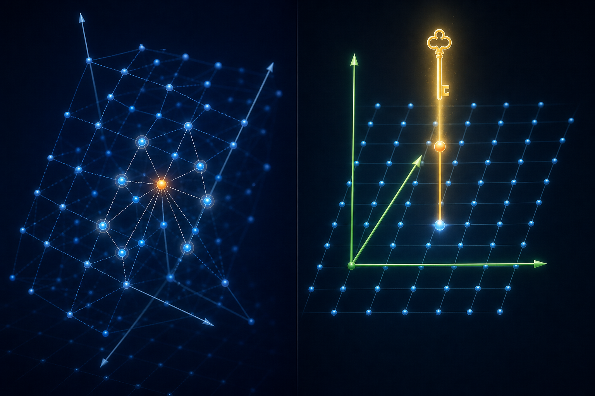
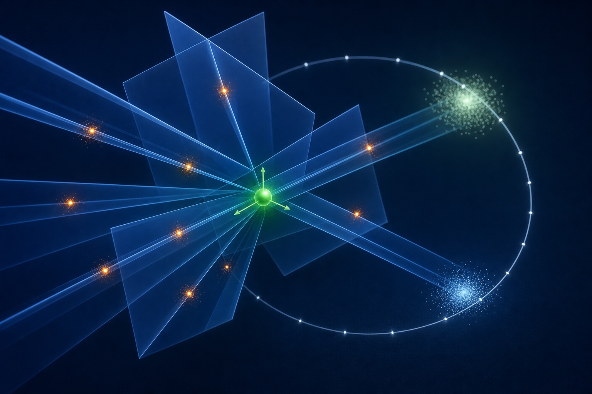
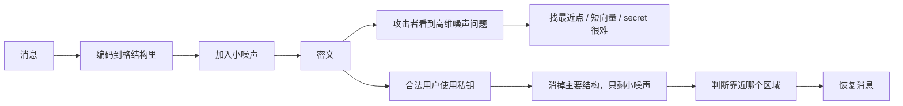

# 格密码学最本质的原理

如果只用一句话说：

**格密码学把秘密藏在一个高维点阵里。没有钥匙的人要在点阵中找最近点或短向量，这在高维里非常难；有钥匙的人知道特殊结构，可以很快把答案找回来。**

这句话里有三个关键词：

- **高维点阵**：很多规则排列的点，但维度很高，不能靠眼睛看。
- **困难问题**：找最近点、找短向量、从带噪声方程恢复秘密。
- **钥匙**：合法用户掌握的 secret 或 trapdoor，让困难问题变得容易。

## 1. 第一幅图：点阵里的“最近点”


你可以先把格想成一张无限延伸的点阵。每个蓝色亮点都是一个合法的格点。

加密时，系统会制造一个“稍微偏离格点”的目标点。图中的橙色点就像密文里的目标：

```text
真实格点 + 小噪声 = 攻击者看到的目标点
```

合法用户有私钥，知道怎么沿着正确方向把它拉回最近的格点。图里的金色路径就是这个直觉。

攻击者没有私钥，只看到很多点和一个偏离的目标。二维里你也许能看出最近点；但真实格密码是在几百维甚至更高维里工作，最近点关系会变得极难判断。

## 2. 二维里看起来简单，高维里会爆炸

二维格大概像这样：

```text
        *       *       *
    *       *       *
        *       *       *
    *       *       *
        *       *       *
```

如果目标点在这里：

```text
        *       *       *
    *       o   *
        *       *       *
```

你一眼就能猜哪个 `*` 最近。

但真实情况更像：

```text
维度 n = 256
每个方向都有很多可能
候选数量随维度指数增长
```

如果每个坐标有 `q` 种可能，暴力搜索的规模大约是：

```text
q^n
```

这就是高维带来的本质困难：不是“图画复杂”，而是候选空间真的爆炸。

## 3. 第二幅图：没有钥匙很乱，有钥匙很清楚



这张图可以理解为同一个问题的两种视角。

左边是攻击者看到的世界：

- 点阵倾斜、纠缠。
- 目标点附近有很多看起来可能的候选点。
- 坐标方向不清楚。
- 想找最近点，需要解困难格问题。

右边是合法用户看到的世界：

- 私钥像一套更好的坐标系统。
- 点阵结构变得清楚。
- 可以快速判断目标应该被拉回哪个格点。

早期格密码可以很直观地理解成：

```text
公钥 = 坏基，看起来乱
私钥 = 好基，看起来清楚
```

现代 LWE、Module-LWE、ML-KEM、ML-DSA 不一定直接把“好基/坏基”当作接口，但背后的安全直觉仍然是类似的：公开信息不足以高效解出隐藏结构。

## 4. 第三幅图：LWE 是“线性方程 + 小错误”



现代格密码里最重要的核心之一是 LWE，Learning With Errors。

没有错误时，攻击者看到的是普通线性方程：

```text
b = <a, s> mod q
```

这里：

- `a` 是公开向量。
- `s` 是秘密向量。
- `b` 是公开结果。

如果有足够多这样的方程，攻击者可以用线性代数解出 `s`。这不安全。

于是 LWE 故意加入小错误：

```text
b = <a, s> + e mod q
```

这里 `e` 是小噪声。

这件事的妙处在于：

- 对攻击者来说，每条方程都差一点点，不能直接用线性代数解。
- 对合法用户来说，噪声足够小，解密时仍然能判断消息落在哪个区域。

所以 LWE 的本质不是“把东西弄乱”这么简单，而是把问题调到一个很精妙的位置：

```text
噪声大到足以阻止攻击者解方程
噪声小到合法用户仍然能正确解密
```

## 5. 用最通俗的话理解 LWE 解密

Toy LWE 可以把一个 bit 编码成两个位置：

```text
bit 0 -> 靠近 0
bit 1 -> 靠近 q/2
```

加密会加入小噪声，所以解密时看到的不是精确的 `0` 或 `q/2`，而是：

```text
bit 0: 0 附近的一小团
bit 1: q/2 附近的一小团
```

只要噪声没有大到跨过边界，合法用户就能判断：

```text
更接近 0   -> 解成 0
更接近 q/2 -> 解成 1
```

攻击者的问题是：他不知道如何把密文变成这个“可判断的位置”。他只能面对一堆带噪声的高维方程。

## 6. 整个过程像什么？

可以把格密码想成一次“有导航的迷宫”：

```text
发送者：
把消息放进高维点阵，并故意推开一点点。

攻击者：
看到偏移后的点，但不知道该回到哪个格点。

接收者：
有私钥导航，知道怎么把点拉回正确区域。
```

流程图如下：



## 7. 为什么这能抗量子？

RSA 和椭圆曲线密码依赖的问题，例如大数分解和离散对数，已经知道会被足够强的量子计算机用 Shor 算法高效破解。

格密码依赖的是另一类问题：

- SVP：找最短非零格向量。
- CVP：找目标点最近的格点。
- LWE：从带噪声线性方程中恢复秘密。
- SIS：找满足模方程的短向量。

到目前为止，没有已知量子算法能像 Shor 算法破解 RSA/ECC 那样高效破解这些高维格问题。这就是格密码成为后量子密码核心路线的原因。

更严谨地说：格密码不是“量子计算机完全不能攻击”，而是目前最好的经典和量子攻击都没有达到破坏标准参数的程度。

## 8. 这和真实标准有什么关系？

真实标准不是直接使用这个 toy 图，而是在这个直觉上做了大量工程和数学加强：

- **ML-KEM**：用于密钥封装，帮助双方建立共享密钥。
- **ML-DSA**：用于数字签名，证明“这确实是私钥持有者签的”。
- **Falcon / FN-DSA**：另一条基于 NTRU lattice 的签名路线。

它们会处理很多 toy 解释里没讲的细节：

- 多项式环和模块结构。
- 噪声采样。
- 压缩和序列化。
- 常数时间实现。
- 抗侧信道攻击。
- CCA 安全转换。

但最底层的画面仍然可以记成：

```text
高维点阵 + 小噪声 + 隐藏结构 = 没钥匙难，有钥匙易
```

## 9. 最容易误解的三点

### 误解一：格密码就是画二维点阵

二维点阵只是教学图。真实安全性来自高维。二维图帮助你理解问题长什么样，高维才让问题难到足以做密码。

### 误解二：噪声越大越安全

不完全对。噪声太小不安全，但噪声太大合法用户也解不回来。密码参数设计要在安全性和正确性之间找平衡。

### 误解三：私钥就是一条金色路径

图片里的金色路径是比喻。真实私钥可能是 LWE secret、多项式短向量、trapdoor 或签名采样所需的隐藏结构。它们共同点是：能让合法操作变容易。

## 10. 读完这篇后怎么继续？

建议顺序：

1. 读 [math-primer.md](math-primer.md)，补齐最小数学基础。
2. 看 [visual-guide.md](visual-guide.md)，把图和正式术语对上。
3. 跑 `examples/01_lattice_basics.py`，亲手枚举二维格点。
4. 跑 `examples/03_toy_lwe_encrypt.py`，观察 bit 如何被噪声扰动又被解回来。
5. 做 [exercises.md](exercises.md) 的前 30 题，再看 [answers.md](answers.md)。

