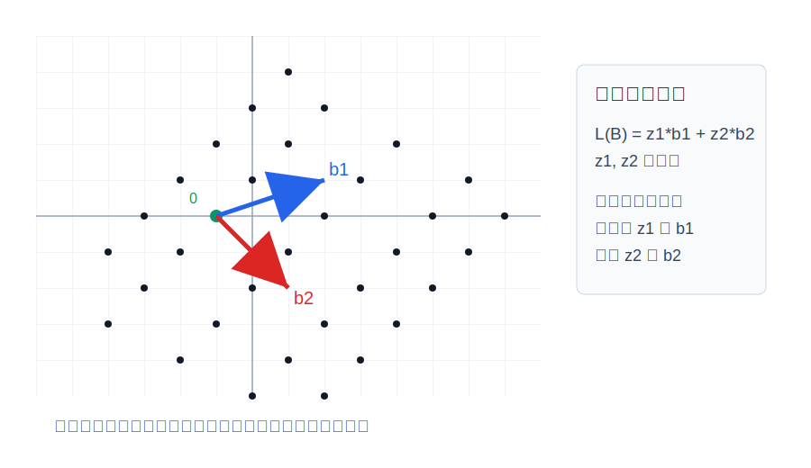
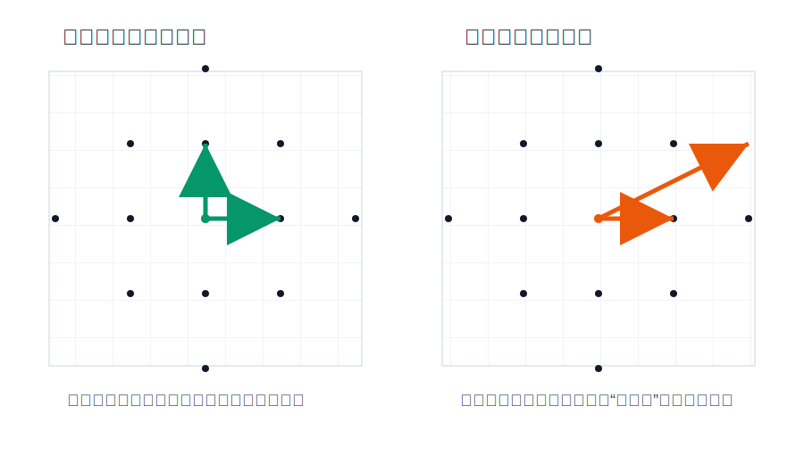
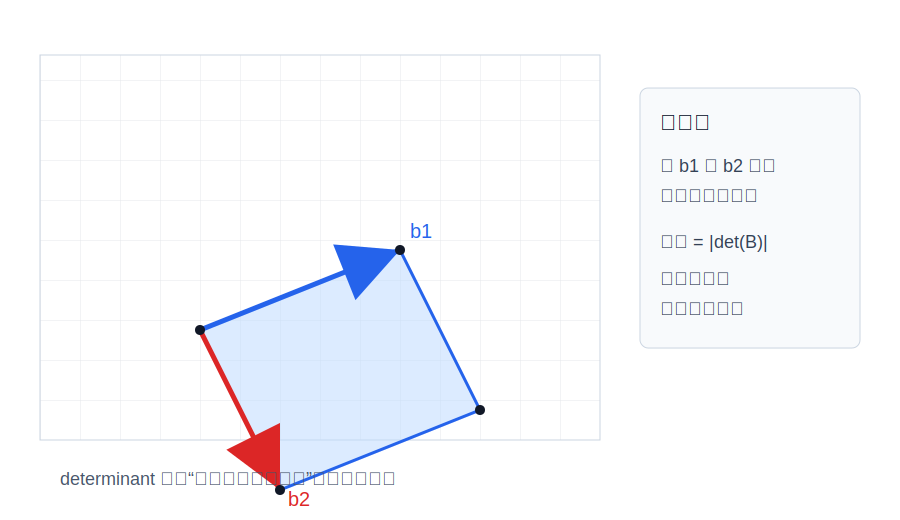
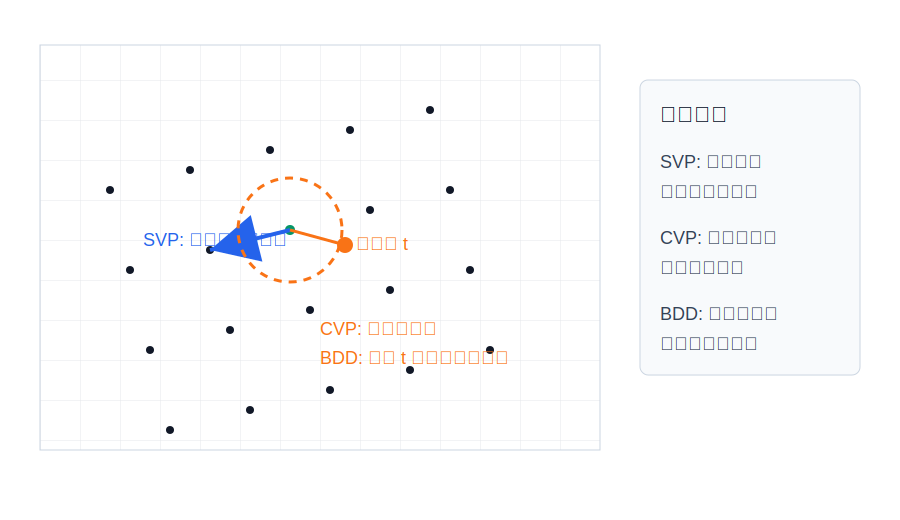
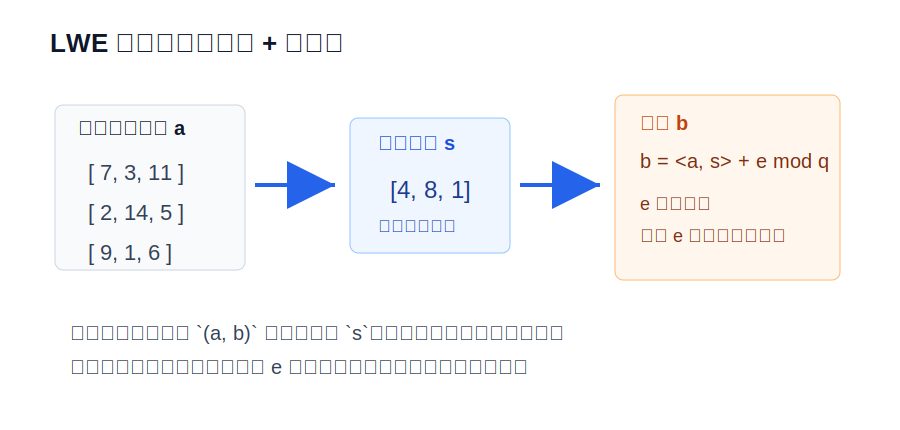
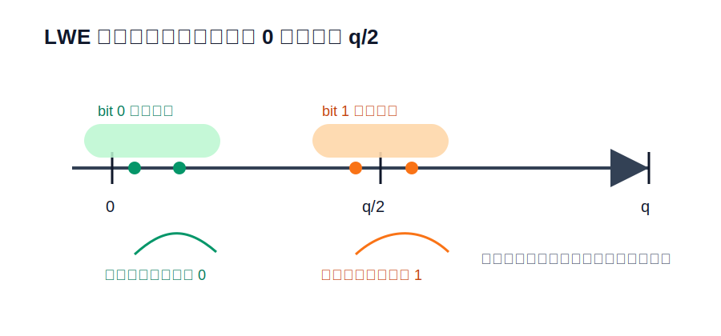
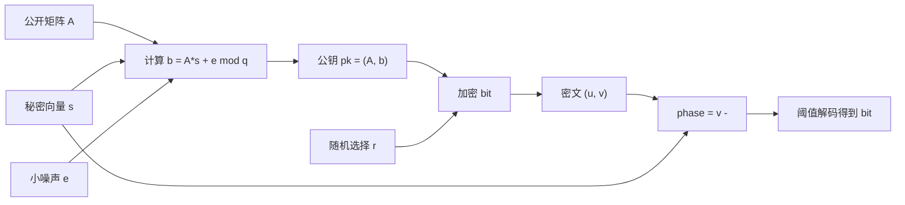
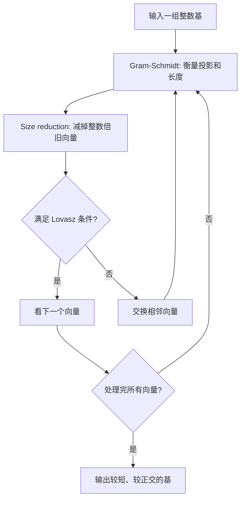
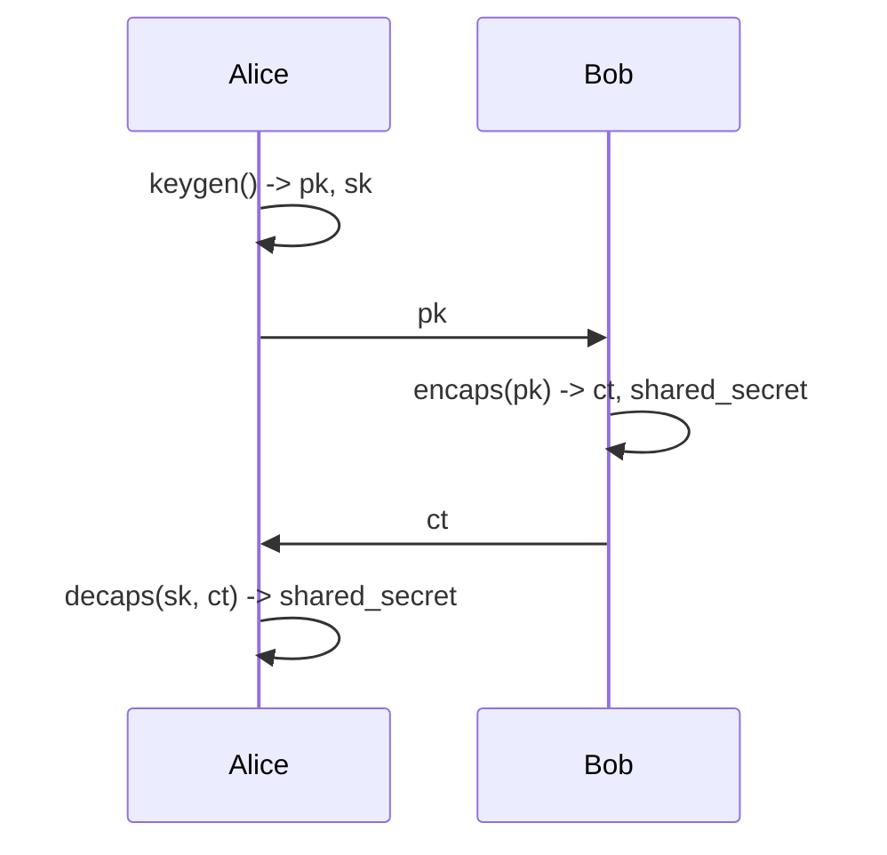
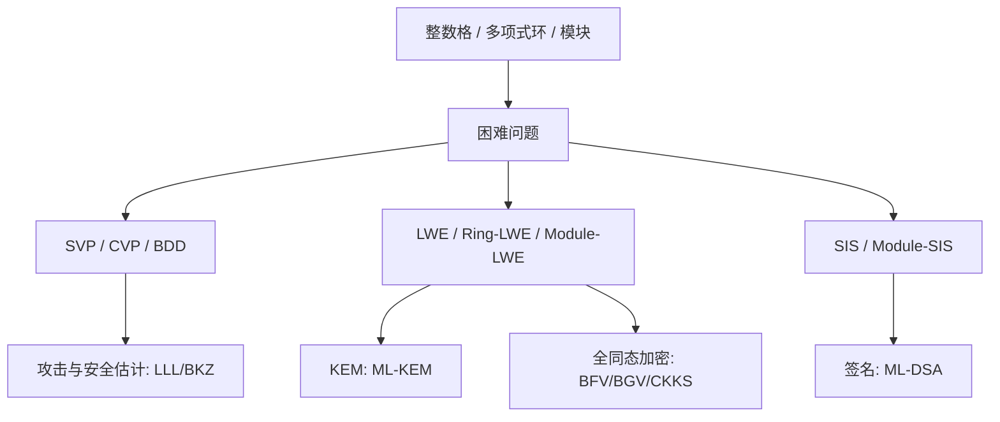

# 图形化理解格基密码

这份文档用图把关键概念串起来。建议先快速看一遍，再回到 `docs/concepts.md` 读定义。

## 1. 格是由整数步长生成的点阵



给定两个基向量 `b1` 和 `b2`，所有形如：

```text
z1*b1 + z2*b2
```

的点构成二维格，其中 `z1` 和 `z2` 必须是整数。

关键直觉：

- 格点不是连续的，而是离散的。
- 格点无限延伸。
- 基向量决定了你能走到哪些点。
- 换一组基，有可能生成同一个点阵。

## 2. 好基和坏基



同一个格可以有很多组基。好基短、方向清楚；坏基长、倾斜。

为什么这对密码学重要？

- 有好基的人更容易解最近点问题。
- 只有坏基的人很难看出最近格点在哪里。
- 早期 GGH 加密就直接使用这个“好基是私钥、坏基是公钥”的直觉。
- 现代 LWE/Module-LWE 方案不直接等同于 GGH，但仍然依赖高维格问题的困难性。

## 3. 基本域和 determinant



两个基向量围成的平行四边形叫基本域。它的面积是：

```text
|det(B)|
```

在更高维中，面积变成体积。

关键直觉：

- determinant 是格点密度的指标。
- determinant 大，格点稀疏。
- determinant 小，格点密集。
- 安全估计经常把维度、determinant 和最短向量长度联系起来。

## 4. SVP、CVP、BDD



三个问题的区别：

- SVP：从原点出发，找最短的非零格向量。
- CVP：给一个任意目标点，找最近的格点。
- BDD：目标点保证离某个格点很近，要把它解码回去。

LWE 解密可以用 BDD 的直觉理解：密文像“正确点 + 小噪声”，私钥帮助你把它拉回正确区域。

## 5. LWE 样本



LWE 样本长这样：

```text
(a, b = <a, s> + e mod q)
```

其中：

- `a` 是公开随机向量。
- `s` 是秘密向量。
- `e` 是小噪声。
- `q` 是模数。

如果 `e = 0`，攻击者只要收集足够多线性方程就能解出 `s`。  
加上小噪声后，每条方程都“差一点点”，普通线性代数无法直接使用。

## 6. Toy LWE 解密阈值



Toy LWE 常把 bit 编码为：

```text
0 -> 0
1 -> floor(q/2)
```

解密计算：

```text
phase = v - <s, u> mod q
```

如果 phase 更接近 `0`，解成 `0`。  
如果 phase 更接近 `q/2`，解成 `1`。

噪声必须小于安全间隔，否则 phase 会跨过判断阈值，造成解密失败。

## 7. LWE 加密数据流



这张图对应本仓库的 `examples/03_toy_lwe_encrypt.py`。

## 8. LLL 的工作循环



LLL 的意义不是“神奇地破解所有格问题”，而是把很多坏基变成相对好用的基。现代攻击通常使用更强的 BKZ，但 LLL 是理解格规约的第一站。

## 9. KEM 的接口



ML-KEM 这类算法不是直接加密长消息，而是建立共享密钥。建立出的 `shared_secret` 再交给对称加密算法保护真实数据。

## 10. 从数学对象到应用



学习时不要把概念孤立记忆。每个概念都可以问三个问题：

1. 它是什么数学对象？
2. 它对应什么困难问题？
3. 它支撑什么密码应用？

